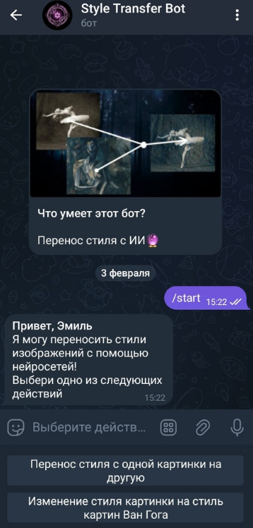
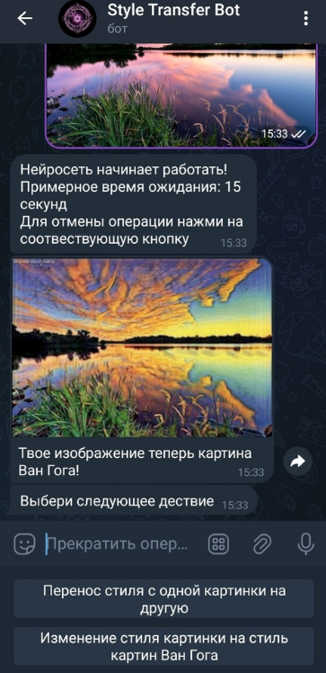

# Style-Transfer Bot
Это Style-Transfer телеграмм бот. Он умеет создавать новые фотографии с помощью нейронных сетей, используя как классический алгоритм Гатиса на базе предобученной VGG19, так и CycleGAN. Бот написан с помощью библиотеки aiogram 3.3 для построения асинхронной архитектуры.
Веса модели CycleGAN, обученной стилизовать изображения под картины Ван Гога, брались из следующего репозитория: https://github.com/bear96/cyclegan-vangogh

### Функционал бота:
#### Перенос стиля с помощью Style Transfer упомянутой выше:
  * Необходимо отправить боту сначала фотографию, стиль которой хотим изменить, а затем фотографию, с которой хотим пересонить стиль.
  * Время работы данной опции около 2 минут

#### Перенос стиля с помощью CycleGAN:
  * Необходимо просто отправить боту фотографию и получить в ответ "картину Ван Гога"
  * Время работы этой опции около 10 секунд

    
## Установка
### Docker + Docker Compose
1. Возьмите файл `docker-compose.yml` из репозитория;
2. Возьмите файл `env_example` там же, переименуйте как `.env`, откройте и заполните переменные;
3. Запустите бота: `docker compose up -d` (или `docker-compose up -d` на старых версиях Docker);
4. Проверьте, что контейнер поднялся: `docker compose ps`
### Обычный запуск 
1. Клонируйте репозиторий;
2. Скопируйте `env_example` под именем `.env`, откройте его и заполните переменные;
3. Установите соответвующие модули из файла requirements.txt;
4. Переместите файл __main__.py из директории `bot` в корень проекта;
5. Запустите бота командой `python __main__.py`;
