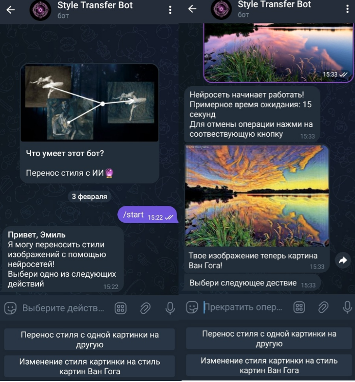

# Style-Transfer Bot
   Style-Transfer телеграмм бот создавает новые изображения с помощью глубоких нейронных сетей, используя как классический алгоритм Гатиса на базе предобученной VGG19, так и CycleGAN. Бот написан с помощью актуальной библиотеки aiogram 3.x для построения асинхронной архитектуры.
Веса модели CycleGAN, обученной стилизовать изображения под картины Ван Гога, были взяты из следующего [репозитория](https://github.com/bear96/cyclegan-vangogh/).                                                            
                                                                                                                                                                                                                        
Основной код находится в `bot_messages.py`. Бот упакован в Docker контейнер и задеплоен на арендованный сервер. Логи собираются логгером в stdout. Бот оснащен антифлудом.

### Функционал бота:
#### Перенос стиля с помощью Style Transfer использующей алгоритм Гатиса:
  * Необходимо отправить боту сначала фотографию, стиль которой хотим изменить, а затем фотографию, с которой хотим пересонить стиль.

#### Перенос стиля с помощью CycleGAN:
  * Необходимо отправить боту изображение и получить в ответ "картину Ван Гога"

  

## Установка
### Docker + Docker Compose
1. Возьмите файл `docker-compose.yml` из репозитория;
2. Возьмите файл `env_example` там же, переименуйте как `.env`, откройте и заполните переменные;
3. Запустите бота: `docker compose up -d` (или `docker-compose up -d` на старых версиях Docker);
4. Проверьте, что контейнер поднялся: `docker compose ps`
### Обычный запуск 
1. Клонируйте репозиторий;
2. Скопируйте `env_example` под именем `.env`, откройте его и заполните переменные;
3. Установите соответвующие модули из файла `requirements.txt`;
4. Переместите файл __main__.py из директории `bot` в корень проекта;
5. Запустите бота командой `python __main__.py`;
